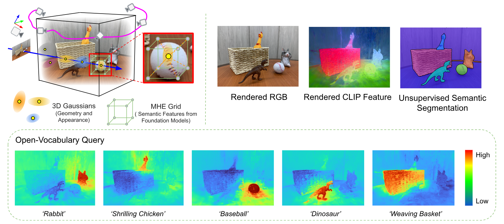
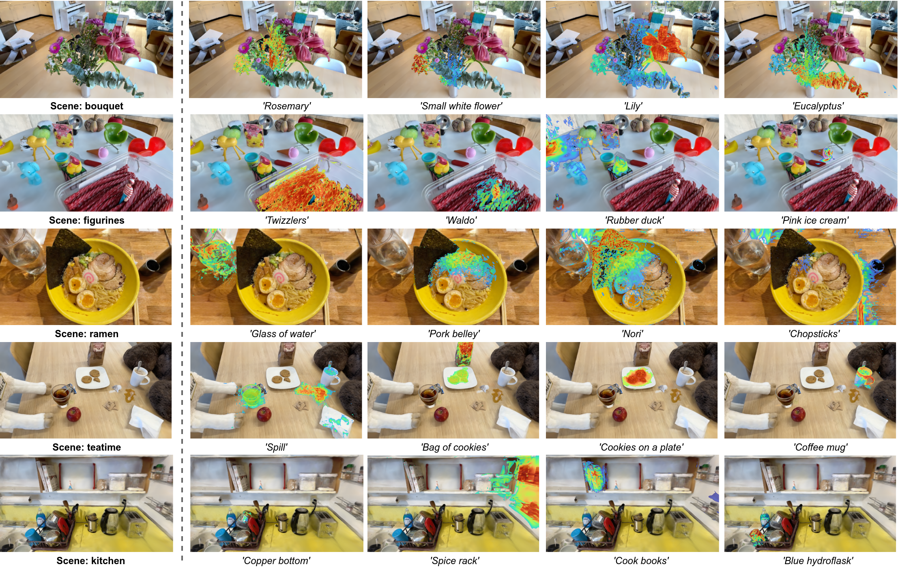

This is not an officially supported Google product. This project is not
eligible for the [Google Open Source Software Vulnerability Rewards
Program](https://bughunters.google.com/open-source-security).

<div align="center">
<h1><b>FMGS</b>:Foundation Model Embedded 3D Gaussian
Splatting for Holistic 3D Scene Understanding </h1>
</div>

<div align="center">
    <a href='https://chuan-10.github.io/' target='_blank'>Xingxing Zuo</a>&emsp;
    <a href='https://po0ya.github.io/' target='_blank'>Pouya Samangouei</a>&emsp;
    <a>Yunwen Zhou</a>&emsp;
    <a href='https://shangbuhuan13.github.io/' target='_blank'>Yan Di</a>&emsp;
    <a>Mingyang Li</a>&emsp;
</div>
<div  align="center">
    Google AR
</div>


<div>
<a target="_blank" href="https://arxiv.org/abs/2401.01970">
  
</a>
</div>

<h4>TL;DR</h4>
<h5>FMGS embeds foundation models to a 3D scene representation that seamlessly integrates 3G Gaussians and multi-resolution hash encodings (MHE). The trained scene representation supports open-vocabulary query of objects and unsupervised semantic segmentation.</h5>

### [Paper](https://arxiv.org/pdf/2401.01970.pdf) | [Project Page](https://xingxingzuo.github.io/fmgs/)



**Abstract**:  Precisely perceiving the geometric and semantic properties of real-world 3D objects is crucial for the continued evolution of augmented reality and robotic applications. To this end, we present Foundation Model Embedded Gaussian Splatting (FMGS), which incorporates vision-language embeddings of foundation models into 3D Gaussian Splatting (GS). The key contribution of this work is an efficient method to reconstruct and represent 3D vision-language models. This is achieved by distilling feature maps generated from image-based foundation models into those rendered from our 3D model. To ensure high-quality rendering and fast training, we introduce a novel scene representation by integrating strengths from both GS and multi-resolution hash encodings (MHE).  Our effective training procedure also introduces a pixel alignment loss that makes the rendered feature distance of same semantic entities close, following the pixel-level semantic boundaries. Our results demonstrate remarkable multi-view semantic consistency, facilitating diverse downstream tasks, like open-vocabulary language-based object detection and unsupervised semantic segmentation at a fast inference speed. This research explores the intersection of vision, language, and 3D scene representation, paving the way for enhanced scene understanding in uncontrolled real-world environments. 

<details span>
<summary><b>Update Log:</b></summary>
<br>
**June 27, 2024**: 
* Initial release of the FMGS  repository.
</details>


<section class="section" id="BibTeX">
  <div class="container is-max-desktop content">
    <h2 class="title">BibTeX</h2>
    <pre><code>@Article{zuo2024fmgs,
      title={Fmgs: Foundation model embedded 3d gaussian splatting for holistic 3d scene understanding},
      author={Zuo, Xingxing and Samangouei, Pouya and Zhou, Yunwen and Di, Yan and Li, Mingyang},
      journal={arXiv preprint arXiv:2401.01970},
      year={2024},
      url={https://xingxingzuo.github.io/fmgs/}
}</code></pre>
  </div>
</section>


## Cloning the Repository

The repository contains submodules, thus please check it out with 
```shell
# SSH
git clone https://github.com/googlestaging/foundation-model-embedded-3dgs.git --recursive
# If you forgot to do --recursive
git submodule update --init --recursive
# Note that the simple-diff-gaussian-rasterization submodule for rendering high-dimensional feature map is already put in "submodules" directory. 

```


## Overview

The components have different requirements w.r.t. both hardware and software. They have been tested on Ubuntu Linux 20.04. Instructions for setting up and running each of them are found in the sections below.

### Hardware and Software Requirements

- CUDA-ready GPU with Compute Capability 7.0+
- 24 GB VRAM (to train to paper evaluation quality)

- Conda (recommended for easy setup)
- C++ Compiler for PyTorch extensions 
- CUDA SDK 11 for PyTorch extensions, install *after* Visual Studio (we used 11.8)
- C++ Compiler and CUDA SDK must be compatible

### Local Setup

Our default, provided install method is based on Conda package and environment management:
```shell
conda env create --file environment.yml
conda activate fmgs
```


## DATA and Pretrained Weights

For open-vocubulary object detection task, we conducted the experiments on [LERF](https://www.lerf.io/) dataset.  The raw LERF dataset is in NS ([NerfStudio](https://docs.nerf.studio/index.html)) format, which is not compatible with Gaussian_Splatting, which operates on [Colmap](https://colmap.github.io/format.html) format dataset. The difference between the two types of data formats is illustrated [here](https://docs.nerf.studio/quickstart/data_conventions.html).  

The provided poses in LERF dataset can be poor sometimes, and we run Colmap by ourselves to get more accurate trajectories. We then  transform the object bounding box labels of LERF dataset to our obtained Colmap trajectories for evaluation. We also share our post-processed dataset, our pretrained weights, and results (relevancy map corresponding to various queries) on this Hugging Face [page](https://huggingface.co/versegg1994/foundation-model-embedded-3dgs/tree/main). Please download it, unzip  and save it  in the 'data/tidy_lerf' folder by:
```shell
mkdir -p data/tidy_lerf
unzip fmgs_postprocessed_lerfdata_trainedweights.zip -d data/tidy_lerf
```


## Running on LERF Dataset

**Inference for open-vocabulary  object detection with trained scene representations: ** 

To render the featuremap and images, get the relevancy maps corresponding to the given open-vocabulary queries. Please run:

```shell
python ./render_lerf_relavancy_eval.py -s $sequence_folder -m $ckpts_path/${sequences[i]} --dataformat colmap  --eval_keyframe_path_filename $eval_path/${sequences[i]}/keyframes_reversed_transform2colmap.json --iteration ${iterations[iter]} 
# Or simply run the script
bash ./scripts/run_eval_on_lerf.sh
```

**Train the scene representation:**

We firstly train the vanilla GaussianSplatting by:

```shell
python train.py -s ${sequence_folder} --model_path $save_path --test_iterations 7000 30000  --save_iterations 7000 30000 --iterations 30000  --checkpoint_iterations 7000 30000  --port 6009
```

Then we start from the trained Vanilla GaussianSplatting checkpoints and embeded the CLIP and DINO semantic features from foundation models:

```shell
python train.py -s ${sequence_folder} --model_path $save_path --opt_vlrenderfeat_from 30000 --test_iterations 32000 32500  --save_iterations 32000 32500 --iterations 32500  --checkpoint_iterations 32000 32500 --start_checkpoint $save_path/chkpnt30000.pth --fmap_resolution 2 --lambda_clip 0.2  --fmap_lr 0.005  --fmap_render_radiithre ${sequences_radiithre[i]} --port 6009

# After training several iterations, enable the dot_p_simloss_w. Note that there is some randomness in different training trials.
python train.py -s ${sequence_folder} --model_path $save_path --opt_vlrenderfeat_from 30000 --test_iterations 33800 34000 34200   --save_iterations 33800 34000 34200 --iterations 34200  --checkpoint_iterations 33800 34000 34200 --start_checkpoint $save_path/chkpnt32500.pth --fmap_resolution 2 --lambda_clip 0.2  --fmap_lr 0.005  --fmap_render_radiithre ${sequences_radiithre[i]} --dotp_simloss_w 0.01 --port 6009
```


## Acknowlegement
Our code is partially dependent on the [3D Gaussian Splatting](https://repo-sam.inria.fr/fungraph/3d-gaussian-splatting/) and [LERF](https://www.lerf.io/), we thanks the authors for the excellent contributions.
